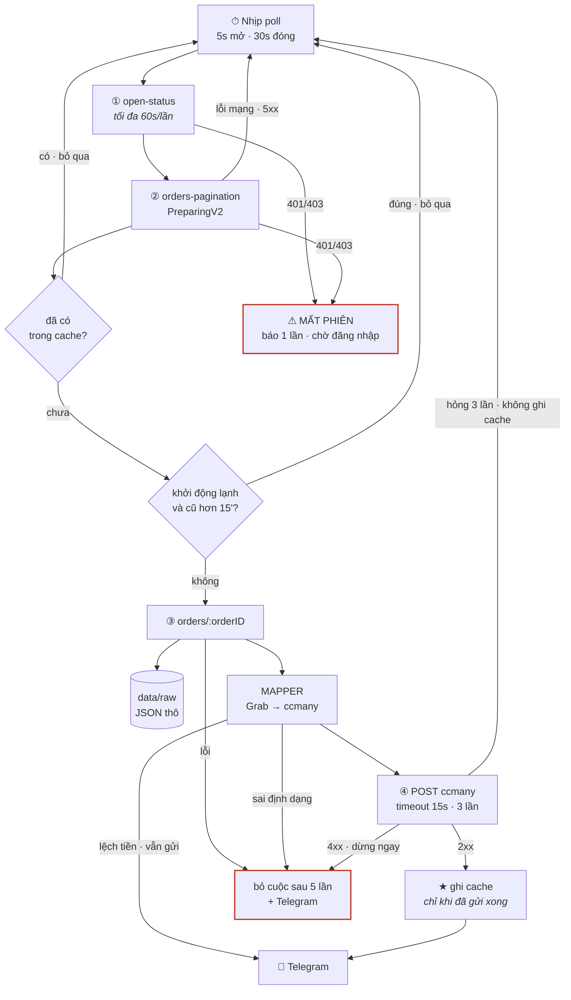

# Spec vận hành — công cụ theo dõi đơn Grab Merchant

Tài liệu này mô tả **công cụ chạy như thế nào trong thực tế**: móc vào trình duyệt ra sao,
máy tính phải ở trạng thái nào, nhiều quán thì tổ chức thế nào, hỏng thì tự phục hồi ra sao.

Phần API, cấu trúc JSON, ánh xạ trường và các bẫy dữ liệu nằm ở
[grab-api-findings.md](grab-api-findings.md) — spec này **không lặp lại**, chỉ tham chiếu.

> **Trạng thái: chờ duyệt.** Đọc xong, cái nào không đồng ý thì nói trước khi viết code.

---

## 1. Công cụ này làm gì

Một câu: **canh trang đơn hàng Grab Merchant trên PC của quán, thấy đơn mới thì đẩy sang API
ccmany trong vòng vài giây, để nhân viên biết mà đi xác nhận.**

### Làm

- Đăng nhập Grab Merchant **một lần bằng tay**, sau đó tự giữ phiên
- Hỏi danh sách đơn tab "Đang chuẩn bị" mỗi **5 giây**
- Thấy đơn chưa từng gặp → lấy chi tiết → chuyển sang định dạng ccmany → POST
- Ghi nhớ đơn đã gửi để không gửi lại
- Báo Telegram khi có sự cố (mất phiên, ccmany chết, poll đứng)

### KHÔNG làm

| Không làm | Vì sao |
|---|---|
| Bấm "Nhận đơn" | Ngoài phạm vi; quyết định nhận đơn là của người |
| Gọi `POST /orders/mark` | Sẽ xoá dấu "chưa đọc" của nhân viên trên web — họ tưởng đơn đã xử lý |
| Gửi cập nhật khi đơn bị huỷ / sửa | Đã chốt "gửi một lần rồi thôi" |
| Đọc sao kê, doanh thu, lịch sử | Không cần cho mục tiêu báo đơn mới |
| Bất kỳ request `POST`/`PUT`/`DELETE` nào tới Grab | **Công cụ chỉ `GET`.** Đây là ranh giới cứng |

---

## 2. Sơ đồ

### 2.1 Poll lấy dữ liệu ở tầng nào

Câu trả lời ngắn: **không đọc giao diện. Đọc thẳng tầng dữ liệu.**

```
                         ┌─── người nhìn thấy ───┐
   ┌─────────────────────────────────────────────────────────────┐
   │  TẦNG 3 · GIAO DIỆN                                         │
   │  Chữ, nút bấm, pixel trên màn hình                          │
   │  "GF-547"   "121.000đ"   [Nhận đơn]                         │
   │                                                             │
   │        ✗  CÔNG CỤ NÀY KHÔNG ĐỌC Ở ĐÂY                       │
   │        ←  (notiftest bên Android thì đọc ở đây:             │
   │            uiautomator dump → parse XML → mò từng chữ)      │
   └───────────────────────────▲─────────────────────────────────┘
                               │  trang tự vẽ giao diện ra từ dữ liệu
   ┌───────────────────────────┴─────────────────────────────────┐
   │  TẦNG 2 · DỮ LIỆU (JSON)                                    │
   │  { "orderID":"0015...", "displayID":"GF-547",               │
   │    "items":[...], "fare":{ "totalDisplay":"121.000" } }     │
   │                                                             │
   │        ✓✓  CÔNG CỤ NÀY LẤY Ở ĐÂY                            │
   │            gọi đúng cái API mà trang web tự gọi              │
   └───────────────────────────▲─────────────────────────────────┘
                               │  HTTPS + cookie đăng nhập
   ┌───────────────────────────┴─────────────────────────────────┐
   │  TẦNG 1 · MÁY CHỦ GRAB — api.grab.com                       │
   │  Kho đơn thật. Nguồn của mọi thứ.                           │
   └─────────────────────────────────────────────────────────────┘
```

**Nói cách khác**: trình duyệt lấy JSON về rồi vẽ thành giao diện cho người xem.
Công cụ chen vào **trước bước vẽ** — lấy luôn JSON, khỏi cần vẽ, khỏi cần đọc chữ trên màn hình.

Hệ quả rất thực tế:

| Grab thay đổi cái gì | Công cụ này | notiftest (Android) |
|---|---|---|
| Đổi giao diện, đổi màu, đổi vị trí nút | ✅ Không ảnh hưởng | ❌ Hỏng, phải sửa parser |
| Đổi ngôn ngữ hiển thị | ✅ Không ảnh hưởng | ❌ Hỏng |
| Đổi cấu trúc JSON của API | ❌ Hỏng, phải sửa mapper | ✅ Không ảnh hưởng |

Đây là lý do bản web dễ nuôi hơn bản Android nhiều: giao diện thì Grab đổi liên tục, còn API
thì hiếm khi đổi, và khi đổi thì thường thêm phiên bản mới (`v3` → `v4`) chứ không phá cái cũ.

### 2.2 Sơ đồ tổng quan

Công cụ chạy **ba đồng hồ độc lập nhau**. Đây là chỗ hay hiểu nhầm nhất: vòng lặp lấy đơn
không tự sửa được cửa sổ hỏng, nên phải có đồng hồ riêng canh việc đó.

```
   ┌──────────────────────────────────────────────────────────────────────────┐
   │  ⚙  TIẾN TRÌNH NODE — mọi đồng hồ đều nằm ở đây, KHÔNG nằm trong trang   │
   │                                                                          │
   │   ⏱  5s / 30s   VÒNG LẶP LẤY ĐƠN      → luồng chính, xem bên dưới        │
   │   ⏱  30s        CANH CỬA SỔ           → cửa sổ Grab chết thì mở lại      │
   │   ⏱  5 phút     GHI PHIÊN XUỐNG ĐĨA   → mất điện không mất đăng nhập     │
   └──────────────────────────────────────────────────────────────────────────┘
```

Vì sao hẹn giờ phải ở Node: Chromium bóp cổ `setTimeout` của tab chạy nền xuống còn ~1
lần/phút. Để vòng lặp trong trang thì cứ thu nhỏ cửa sổ là công cụ chết lâm sàng, không báo lỗi.

### Luồng chính, kèm mọi nhánh hỏng

```
  ⏱ NHỊP POLL ─── 5s khi quán mở · 30s khi quán đóng hoặc mất phiên
        │
        ▼
  ① GET open-status ──────────────── hỏi lại tối đa 60s/lần, không mỗi nhịp
        │                                   │
        │                                   └─ 401/403 ─► ⚠ MẤT PHIÊN
        ▼                                                  báo Telegram MỘT lần
  ② GET orders-pagination (PreparingV2)                    giãn nhịp 30s
        │                                                  chờ người đăng nhập lại
        ├─ 401/403 ──────────────────────────────────────► (như trên)
        ├─ lỗi mạng / 5xx / timeout 20s ─► ghi log, giữ nguyên nhịp, thử lại nhịp sau
        │
        ▼
  ┌─ với TỪNG đơn trong danh sách ────────────────────────────────────────────┐
  │                                                                           │
  │   orderID đã có trong cache?  ──── có ──► bỏ qua (log mức debug)          │
  │        │ chưa                                                             │
  │        ▼                                                                  │
  │   khởi động lạnh VÀ createdAt cũ hơn 15 phút?  ── đúng ──► bỏ qua (log)   │
  │        │ không                                                            │
  │        ▼                                                                  │
  │   ③ GET orders/{orderID}                                                  │
  │        ├─ lỗi ──► đếm lần thử ─┬─ < 5 lần ─► thử lại ở nhịp sau           │
  │        │                       └─ ≥ 5 lần ─► BỎ CUỘC, báo Telegram 1 lần  │
  │        ▼                                                                  │
  │   lưu data/raw/{orderID}.json                                             │
  │        └─ ghi hỏng ──► cảnh báo, VẪN đi tiếp (mất tài liệu < mất đơn)     │
  │        ▼                                                                  │
  │   MAPPER: Grab JSON → payload ccmany                                      │
  │        ├─ thiếu orderID / giá sai định dạng ──► ném lỗi, xử như ③         │
  │        └─ số tiền lệch nhau ──► CẢNH BÁO nhưng vẫn gửi + Telegram         │
  │        ▼                                                                  │
  │   ④ POST ccmany · timeout 15s                                             │
  │        ├─ 2xx ─────────────────────────► thành công                       │
  │        ├─ 4xx (trừ 408/429) ──► DỪNG NGAY, không thử lại — lỗi phía mình  │
  │        ├─ 5xx / 408 / 429 / mạng ──► thử lại 3 lần, giãn 1,5s → 3s        │
  │        └─ hỏng cả 3 lần ──► KHÔNG ghi cache ──► nhịp sau thử lại          │
  │        ▼                                                                  │
  │   ★ GHI CACHE ─── CHỈ ở đây, chỉ khi POST đã thành công                   │
  │        ▼                                                                  │
  │   Telegram: mã đơn · tiền · danh sách món                                 │
  └───────────────────────────────────────────────────────────────────────────┘
        │
        ▼
  ngủ tới nhịp sau  (setTimeout nối tiếp, KHÔNG setInterval —
                     một nhịp chậm không được chồng lên nhịp sau)
```

**Ba chỗ in đậm trong sơ đồ là ba nguyên tắc không được phá:**

| ★ | Ghi cache **sau** khi gửi thành công | Ghi trước mà POST hỏng thì đơn đó vĩnh viễn không bao giờ được gửi lại |
| ⚠ | Mất phiên báo **một lần** | Không thì cứ 5 giây một tin Telegram cho tới khi có người xử lý |
| ⏱ | Hẹn giờ ở **Node** | Trong trang thì bị Chromium bóp cổ khi cửa sổ ẩn |

### Khi hỏng thì sao — bảng đối chiếu

| Hỏng ở đâu | Biểu hiện | Xử lý | Cần người? |
|---|---|---|---|
| Mất mạng | `listPreparing` lỗi | Ghi log, thử lại mỗi nhịp | Không |
| ccmany chết | POST 5xx / timeout | Thử 3 lần, không ghi cache, nhịp sau thử lại | Không |
| ccmany từ chối payload | POST 4xx | Dừng ngay; sau 5 nhịp thì bỏ cuộc + Telegram | **Có** — sửa mapper |
| Grab đổi API | Mapper ném lỗi | Bỏ qua đơn, giữ `data/raw/`, Telegram | **Có** — sửa mapper |
| Số tiền lệch nhau | Mapper cảnh báo | **Vẫn gửi**, kèm Telegram để đối chiếu | Đối chiếu sau |
| Cửa sổ Grab bị huỷ | Mọi API báo "chưa sẵn sàng" | Đồng hồ 30s mở lại — đo thật: phục hồi sau ~20s | Không |
| Hết phiên Grab | 401/403 | Giãn nhịp 30s, Telegram, tự chạy lại khi đăng nhập xong | **Có** — đăng nhập |
| Mất file cache | Khởi động lạnh | Chỉ nhận đơn trong 15 phút gần nhất, không bắn lại cả tab | Không |
| Tiến trình bị giết | — | Task Scheduler chạy lại; phiên đã ghi đĩa mỗi 5 phút | Không |
| Đĩa đầy | Ghi `raw`/log hỏng | Nuốt lỗi, vẫn gửi đơn | **Có** — dọn đĩa |

Cột cuối là cột đáng nhìn nhất: **chỉ bốn dòng cần tới con người**, và ba trong số đó đều
được Telegram báo ra ngoài.

### 2.3 Bản mermaid



---

## 3. Móc nối vào Grab Merchant bằng cách nào

Đây là câu hỏi trung tâm, nên nói kỹ.

### 3.1 Vì sao phải qua trình duyệt

Xác thực của Grab là **cookie** (đã xác minh — xem §2 của `grab-api-findings.md`). Cookie đó:

- Không nằm ở chỗ nào đọc được dễ dàng ngoài profile trình duyệt
- Được gia hạn theo phiên khi trang còn sống
- Chỉ lấy được sau khi đăng nhập bằng tay (có thể có OTP)

Nên mình **không tự gọi API từ Node bằng `axios`** — sẽ phải tự bóc cookie, tự lo hết hạn,
tự lo OTP. Thay vào đó: mở một Chromium do mình điều khiển, đăng nhập tay một lần, rồi
**gọi API từ bên trong trang đó**.

### 3.2 Cơ chế cụ thể

```
Node                                          Chromium (trang merchant.grab.com)
────                                          ──────────────────────────────────
chromium.launchPersistentContext(
   userDataDir: ./data/browser-profile )
                                              → khôi phục cookie từ lần trước
page.goto('https://merchant.grab.com/
           order/5-C7XUNYEVEADYN2/preparing')
                                              → trang chạy bình thường, phiên sống

mỗi 5 giây:
  page.evaluate(async (mexID) => {
    const r = await fetch(
      `https://api.grab.com/delvplatformapi/
       merchant/v4/orders-pagination?...`,
      { credentials: 'include',            ──► trình duyệt TỰ gắn cookie
        headers: { merchantID, requestSource,
                   'x-client-id', ... } });
    return { status: r.status,
             body: await r.json() };
  }, mexID)
       ◄── kết quả trả về Node dưới dạng JSON
```

Vì `fetch` chạy **bên trong trang**, trình duyệt tự lo: cookie, `Origin`, `Referer`, CORS
preflight — đúng y như khi trang tự gọi. Mình không giả mạo gì cả.

> **Phương án thay thế** (nếu `page.evaluate` gặp trở ngại): Playwright có
> `context.request.get()` dùng chung kho cookie của context. Sạch hơn nhưng phải tự set
> `Origin`/`Referer`. Để dành làm dự phòng.

### 3.3 Vòng lặp hẹn giờ nằm ở Node, KHÔNG nằm trong trang

Chi tiết nhỏ nhưng cực quan trọng: Chromium **bóp cổ `setTimeout`/`setInterval` của tab chạy
nền** — tab bị che khuất hoặc cửa sổ thu nhỏ thì hẹn giờ bị giãn xuống còn ~1 lần/phút.
Nếu để vòng lặp poll chạy bằng JS trong trang, cứ minimize cửa sổ là công cụ chết lâm sàng
mà không báo lỗi gì.

Nên: **`setInterval` nằm ở Node** (không bị bóp), mỗi nhịp gọi `page.evaluate` một phát.
Kèm theo đó, mở Chromium với các cờ:

```
--disable-background-timer-throttling
--disable-backgrounding-occluded-windows
--disable-renderer-backgrounding
```

### 3.4 Headed hay headless

Chạy **headed** (có cửa sổ thật). Lý do:

- Đăng nhập lần đầu và đăng nhập lại bắt buộc phải thấy màn hình (có thể có OTP)
- Ít bị nghi là bot hơn
- Khi có sự cố, mở ra nhìn là biết ngay đang kẹt ở đâu

Cửa sổ có thể **thu nhỏ**, không cần nhìn thấy. Đã có cờ chống bóp cổ ở trên.

Hai lệnh chạy:

| Lệnh | Dùng khi | Chế độ |
|---|---|---|
| `npm run login` | Lần đầu, hoặc khi mất phiên | Headed, dừng lại chờ bạn đăng nhập xong |
| `npm run start` | Chạy thường ngày (tự khởi động cùng Windows) | Headed, thu nhỏ, tự chạy |

Cả hai **dùng chung một `userDataDir`**, nên đăng nhập một lần là lần sau tự vào.

### 3.5 Profile riêng, không đụng trình duyệt của người

Chromium của công cụ dùng thư mục profile riêng (`data/browser-profile/`), **tách hoàn toàn**
khỏi Chrome/Edge mà người dùng bình thường. Hệ quả:

- Nhân viên đóng trình duyệt của họ → công cụ không sao
- Nhân viên xoá cookie, đăng nhập tài khoản khác → công cụ không sao
- Ngược lại, **không được tự tay đóng cửa sổ Chromium của công cụ** — đóng là dừng luôn

> ✅ **Đã kiểm chứng 2026-08-28**: Grab **cho phép nhiều phiên đăng nhập cùng lúc**.
> Đăng nhập vào cửa sổ của công cụ **không** làm phiên trên điện thoại hay Edge bị đá ra.
> Rủi ro vận hành lớn nhất của phương án này coi như đã gỡ.
>
> Phiên cũng **sống qua lần khởi động lại app** — đăng nhập một lần, mở lại vào thẳng.

---

## 4. Độ trễ — từ lúc khách đặt tới lúc đơn về ccmany

Các bước đầy đủ kèm nhánh hỏng nằm ở §2.2. Mục này chỉ nhìn theo **trục thời gian**.

```
 t = 0s      Khách đặt đơn · Grab ghi times.createdAt
                 │
                 │   cổng web của Grab phải tới ~60s sau mới biết
                 │   (đo được từ HAR: đơn tạo 10:07:28, trang thấy 10:08:20)
                 ▼
 t ≤ 5s      Nhịp poll bắt được đơn trong danh sách
                 ▼
 t + ~0,3s   Lấy chi tiết đơn
                 ▼
 t + ~0,5s   Biến đổi + POST lên ccmany
                 ▼
 t + ~0,6s   Ghi cache · bắn Telegram

 → Độ trễ điển hình: 1–6 giây. Nhanh hơn chính cổng web của Grab khoảng 10 lần.
```

Ba điều làm độ trễ xấu đi, theo thứ tự hay gặp:

| Nguyên nhân | Độ trễ thành | Ghi chú |
|---|---|---|
| Quán vừa mở cửa | tới 30s | `open-status` chỉ hỏi lại mỗi 60s, nên nhịp 30s còn kéo dài thêm chút |
| ccmany chậm | +1,5s mỗi lần thử lại | Tối đa 3 lần |
| Mất phiên | vô hạn | Chờ người đăng nhập lại |

### Vì sao ghi cache sau khi POST thành công, không phải trước

Nếu ghi trước mà POST hỏng, đơn đó **vĩnh viễn không bao giờ được gửi lại** — công cụ tưởng
đã xong. Ghi sau thì tệ nhất là gửi trùng một lần (khi POST thành công nhưng ghi cache hỏng),
mà gửi trùng thì ccmany còn dedup được bằng `order_number`, còn mất đơn thì không cứu được.

---

## 5. Vòng đời một đơn, nhìn từ công cụ

```
   ┌─────────┐  thấy trong orders-pagination
   │  MỚI    │  (không quan tâm acceptedAt)
   └────┬────┘
        │ gọi detail
        ▼
   ┌─────────┐  detail lỗi / JSON lạ
   │ ĐANG ĐỌC├──────────────────────► ┌────────┐
   └────┬────┘                         │  LỖI   │ ─┐
        │ mapper OK                    └────────┘  │ thử lại
        ▼                                   ▲      │ ở lượt
   ┌─────────┐  POST hỏng cả 3 lần          │      │ poll sau
   │ ĐANG GỬI├──────────────────────────────┘      │
   └────┬────┘                                     │
        │ POST 2xx                            ◄────┘
        ▼
   ┌─────────┐
   │ ĐÃ GỬI  │  ghi vào cache — không bao giờ đụng lại
   └─────────┘
```

Đơn ở trạng thái **LỖI** không được ghi cache, nên lượt poll sau nó lại hiện ra như đơn mới và
được thử lại. Số lần thử có trần (mặc định 5) để một đơn hỏng vĩnh viễn không làm kẹt hàng đợi;
quá trần thì bắn Telegram kèm `orderID` và bỏ qua.

---

## 6. Chống gửi trùng — hai lớp

Vì công cụ **không bao giờ bấm nhận đơn**, đơn nằm lì trong tab "Đang chuẩn bị" cho tới khi
nhân viên xử lý. Nghĩa là mỗi lượt poll đều nhìn thấy lại đúng những đơn đó.
**Cache là thứ duy nhất chặn gửi trùng** — y như notiftest.

| Lớp | Cơ chế | Chặn được gì |
|---|---|---|
| 1 | Cache `{ccmanyStoreID}:{orderID}`, ghi ra `data/cache/`, nạp lại lúc khởi động | Gửi trùng khi poll lặp, và khi khởi động lại bình thường |
| 2 | Chỉ xử lý đơn có `createdAt > max(mốc đã lưu, lúc khởi động − 15 phút)` | Mất/hỏng file cache thì cũng chỉ gửi lại đơn của 15 phút gần nhất, thay vì cả tab |

Lớp 2 vá đúng lỗ hổng còn tồn tại ở notiftest (mất cache → sweep bắn lại toàn bộ danh sách).

Cache giới hạn theo số lượng (mặc định 500 đơn gần nhất mỗi quán), cũ nhất bị đẩy ra.

---

## 7. Nhiều quán

Đã xác nhận: **một tài khoản Grab quản nhiều quán**. Điều đó làm mọi thứ đơn giản.

### 7.1 Cách tổ chức

Cookie là **của tài khoản**, không phải của từng quán. Mã quán đi kèm mỗi request qua tham số
`merchantID` và header `merchantid`. Nên:

```
1 Chromium  →  1 profile  →  1 tab
                              │
                              ├── poll quán A (merchantID = 5-AAA...)
                              ├── poll quán B (merchantID = 5-BBB...)
                              └── poll quán C (merchantID = 5-CCC...)
```

**Một tab phục vụ tất cả các quán.** Thêm quán không tốn thêm RAM, chỉ tốn thêm request.
Các quán poll **lệch pha nhau** (quán thứ n bắt đầu trễ `n × 5s/số_quán`) để không dồn cục.

> **ĐÃ KIỂM CHỨNG — 01/09/2026, tài khoản 14 quán.** Bảy lần thử, bảy quán khác nhau: cửa sổ
> đang mở trang quán X, gọi `open-status` và `orders-pagination` bằng `merchantID` của quán Y
> — **cả bảy đều 200**. Một tab phục vụ được tất cả. Phương án dự phòng "mỗi quán một tab"
> không cần tới.
>
> Chạy bằng `DEV_THU_CHEO=true` ([thu-cheo.ts](../src/main/thu-cheo.ts)): bật cờ rồi bấm sang
> một quán khác trong cửa sổ Grab, kết luận in thẳng vào nhật ký.
>
> Một cái bẫy khi đọc kết quả: mã quán **không thuộc tài khoản đang đăng nhập** trả về `400`
> chứ không phải `401`. Lần đo đầu tiên trượt vì đúng chuyện đó — cấu hình còn trỏ vào quán
> của tài khoản cũ, nên mọi lời gọi đều `400` kể cả khi cửa sổ đang mở đúng quán ấy. Thấy
> `400` thì kiểm tra mã quán có nằm trong nhóm không, trước khi kết luận gì về chéo quán.

**Không có API trả đơn của tất cả quán trong một lời gọi.** Trang "Tất cả các cửa hàng"
(`/order`) chỉ là bảng chọn: nó gọi `merchant-group/store/search` để lấy danh sách, còn đơn thì
vẫn lấy từng quán qua `orders-pagination?merchantID=…`. Nên poll từng quán là bắt buộc, và
việc rải lệch pha ở trên không phải tối ưu hoá mà là điều kiện cần khi số quán tăng.

### 7.1b Lấy danh sách quán tự động

```
GET /delvplatformapi/merchant/v1/merchant-group/store/search
      ?offset=0&limit=100&cityIDs=ALL&includeInactive=true&search=&asc=true
```

Trả về, ở cấp **nhóm** chứ không phải cấp quán:

```jsonc
{
  "merchantGroupID": "VNMG…",
  "merchants": [
    { "merchantID": "5-…", "merchantName": "…", "city": "…", "address": "…",
      "status": "…", "modelType": "…", "menuDisplayOption": "…",
      "timezone": "…", "deliverOption": "…" }
  ]
}
```

Một lời gọi ra hết mã lẫn **tên thật**. Nghĩa là bảng chọn quán không cần ai gõ mã, và `status`
cho phép bỏ qua quán đã ngừng hoạt động. `limit=100` lấy theo đúng trang Grab; trên 100 quán
thì phải phân trang bằng `offset`.

### 7.2 File cấu hình là nguồn sự thật duy nhất

`config/stores.json`:

```jsonc
{
  "stores": [
    {
      "grabMerchantID": "5-C7XUNYEVEADYN2",   // lấy từ URL trang đơn hàng
      "ccmanyStoreID":  "STORE1",             // mã do ccmany cấp
      "storeName":      "Tên quán",
      "enabled":        true
    }
  ]
}
```

Thêm quán = thêm một khối, khởi động lại tiến trình. **Không sửa code, không build lại**
(khác notiftest — bên đó mã quán nằm trong `BuildConfig`, đổi là phải build + cài lại app).

Cache tách theo `ccmanyStoreID` nên hai quán không thể dẫm chân nhau.

---

## 8. Máy tính phải ở trạng thái nào

Câu hỏi hay gặp nhất, nên liệt kê thẳng:

| Trạng thái | Có chạy được không | Ghi chú |
|---|---|---|
| **Màn hình tắt** (monitor ngủ) | ✅ Chạy bình thường | Chromium không cần pixel hiển thị |
| **Khoá màn hình** (`Win+L`) | ✅ Chạy bình thường | Phiên Windows vẫn sống |
| **Cửa sổ Chromium thu nhỏ** | ✅ Chạy bình thường | Nhờ 3 cờ chống bóp cổ ở §3.3 |
| **Cửa sổ bị che bởi app khác** | ✅ Chạy bình thường | Như trên |
| **Máy ngủ / ngủ đông** (Sleep/Hibernate) | ❌ **DỪNG** | Bắt buộc tắt trong Power Options |
| **Đăng xuất Windows** (Sign out) | ❌ **DỪNG** | Phiên bị huỷ, Chromium chết theo |
| **Khởi động lại máy** | ⚠️ Tự chạy lại **nếu** đã bật tự đăng nhập Windows | Xem §9 |
| **Mất mạng** | ⚠️ Tạm dừng, tự nối lại | Đơn phát sinh trong lúc mất mạng vẫn bắt được khi có mạng lại, miễn còn trong tab |
| Chạy như **Windows Service** | ❌ Không dùng | Service chạy ở session 0, không có desktop → không mở được cửa sổ trình duyệt |

**Ba thứ bắt buộc phải cấu hình trên PC:**

1. **Tắt Sleep và Hibernate** — Settings → Power → *Screen and sleep* → `Never` (mục sleep).
   Màn hình tắt thì thoải mái, chỉ máy là không được ngủ.
2. **Bật tự đăng nhập Windows** — để sau khi mất điện / cập nhật Windows, máy khởi động lại là
   tự vào desktop, công cụ tự chạy. Không có cái này thì mỗi lần reboot phải có người tới gõ
   mật khẩu.
3. **Hoãn cập nhật tự động khởi động lại** — đặt Active hours trùng giờ mở quán.

---

## 9. Khởi động và tự phục hồi

### Chuỗi khởi động

```
Windows khởi động
   └── tự đăng nhập vào tài khoản Windows
         └── Task Scheduler (trigger: At log on) chạy grab-watcher
               └── mở Chromium với profile đã lưu
                     ├── vào được trang đơn hàng?  ──► bắt đầu poll
                     └── bị đá về trang đăng nhập? ──► Telegram: "CẦN ĐĂNG NHẬP LẠI"
                                                        rồi chờ, poll lại mỗi 60s
```

Dùng **Task Scheduler** với trigger *"At log on"*, **không dùng Windows Service** (lý do ở
bảng §8).

### Tự phục hồi

Bảng đối chiếu đầy đủ ở **§2.2**. Ở đây chỉ ghi những thứ thuộc về *vòng đời tiến trình*,
tức là các lớp bảo vệ nằm ngoài vòng lặp lấy đơn:

| Lớp | Cơ chế | Trạng thái |
|---|---|---|
| Cửa sổ Grab bị huỷ | Đồng hồ 30s gọi `ensureOpen()`, mở lại rồi kiểm tra kết nối | ✅ đã làm, đo được ~20s phục hồi |
| **Trang thành trang lỗi Chromium** | Đồng hồ 30s phát hiện `did-fail-load` rồi tải lại | ✅ đã làm |
| **Cảnh báo phát sinh lúc mất mạng** | Xếp hàng, gửi bù khi có lượt poll thành công | ✅ đã làm |
| **Phục hồi không ai biết** | Mỗi lần trở lại bình thường ghi một dòng `DA PHUC HOI` + Telegram | ✅ đã làm |
| Phiên mất khi tắt đột ngột | Ghi cookie xuống đĩa mỗi 5 phút và trước khi thoát | ✅ đã làm |
| Reload trang định kỳ | Mỗi 60 phút; hoãn lại nếu đang xử lý dở một đơn | ✅ đã làm |
| Poll đứng im không báo lỗi | Watchdog theo **mốc poll thành công gần nhất**, không theo URL | ✅ đã làm |
| Nhịp tim định kỳ | Telegram báo còn sống, mỗi 30 phút | ✅ đã làm |
| Đĩa đầy dần | Xoá `data/raw/` quá hạn (6h/lần), xoay vòng log ở 2 MB × 4 file | ✅ đã làm |
| Tự chạy cùng Windows | `app.setLoginItemSettings` — chỉ có tác dụng ở bản đóng gói | ✅ đã làm |
| Tiến trình Node chết | Task Scheduler *Restart on failure* | ⏳ Task 12 |

> ⚠️ Watchdog **phải** bám vào mốc poll thành công, **không** bám vào URL của trang.
> Đã quan sát được: Grab tự nhảy `/profile/logout` → trang đăng nhập → quay lại trong
> khoảng 2 giây rồi hoạt động bình thường. Watchdog nhìn URL sẽ đá nhầm đúng lúc nó
> đang tự phục hồi.

### Bốn cái bẫy của "mất mạng", phát hiện khi thử thật

Rút mạng ra là phép thử tưởng đơn giản nhất, nhưng nó phơi ra ba lỗi mà đọc code không thấy:

**1. Cảnh báo về mất mạng thì phải gửi qua mạng.** Không có hàng chờ thì đúng lúc cần báo nhất
là lúc chắc chắn báo không tới — và sau khi mạng về cũng không có nốt, vì cờ "đã báo một lần"
đã lật rồi. Nên mọi tin gửi hỏng đều được giữ lại (trần 20 tin, **giữ tin cũ nhất** vì tin đầu
tiên mới nói được sự cố bắt đầu lúc nào) và gửi bù kèm giờ phát sinh.

**2. Trang lỗi của Chromium là trạng thái chết lặng.** Tải trang thất bại một lần thì cửa sổ vẫn
còn, `runner()` vẫn trả về webContents, nhìn qua mọi thứ bình thường. Nhưng tài liệu đang hiển
thị là `chrome-error://chromewebdata/`, và `fetch` từ đó sang `api.grab.com` **không bao giờ
thành công nữa, kể cả khi mạng đã về**. Chỉ tải lại trang mới thoát ra được — nên đồng hồ 30s
phải canh riêng việc này, không đợi watchdog 3 phút.

**3. Ở mức log `info`, poll thành công không ghi gì cả.** Chỉ poll hỏng mới ghi. Nghĩa là đọc log
**không phân biệt được** "đã chạy lại rồi" với "vẫn hỏng, chỉ là thôi không ghi nữa". Mọi lần
trở lại bình thường phải có một dòng rõ ràng — phục hồi phải ồn ào ngang với hỏng.

**4. Cờ "trang đang hỏng" bị chính Chromium xoá ngay sau khi bật.** Khi một lần tải thất bại,
Chromium nạp trang lỗi của nó **như một tài liệu bình thường**, nên thứ tự sự kiện là:

```
did-start-loading → did-fail-load → did-finish-load → did-stop-loading
                    ^ bật cờ        ^ xoá cờ ngay lập tức
```

Xoá cờ ở `did-finish-load` là đường sửa nhanh 30 giây **không bao giờ chạy**, và phải đợi
watchdog 3 phút mới thoát ra được. Cờ phải xoá ở `did-start-loading`.

### Thử mất mạng mà không phải rút dây

Hai lần đầu thử bằng cách rút mạng thật, cả hai lần đều **kết luận sai**: mất mạng thật thì
không điều khiển được thời điểm, không lặp lại được, và người thử bỏ cuộc trước khi app kịp
phục hồi (lần đó nó phục hồi ở phút thứ 6, sau khi đã bị kết luận là hỏng).

Nên có `DEV_CHAOS=true`: app tự ngắt mạng **của riêng phiên Grab** 200 giây rồi nối lại, ghi rõ
từng mốc vào nhật ký. Chạy hết trong 4 phút, lặp lại được, đọc kết quả thẳng từ log.

Hai điều đã học khi làm cái này:

- **`enableNetworkEmulation` không chặn được `fetch` chạy trong trang.** Poll vẫn thành công 15
  giây sau khi "ngắt mạng" — phép thử báo xanh giả. Phải dùng `webRequest.onBeforeRequest` huỷ
  mọi request thì mới chặn được cả điều hướng lẫn fetch.
- **Đừng viết chuỗi đánh dấu cần tìm vào chính dòng thông báo kỳ vọng.** Vòng chờ tự động khớp
  trúng dòng "kỳ vọng thấy X" chứ không phải sự kiện X, và báo thành công trong khi chưa có gì
  xảy ra.

> ⚠️ `DEV_CHAOS` tuyệt đối không được bật trên máy quán.

### Chạy dài ngày — cái gì sẽ hỏng trước

Câu hỏi thật: **điều kiện lý tưởng thì nó chạy được bao lâu?**

Trả lời thẳng: **không có "mãi mãi", nhưng cũng không phải "nửa hôm là crash".** Nếu nửa ngày
đã chết thì đó là bug, không phải giới hạn. Mục tiêu hợp lý là **hàng tuần không cần đụng vào**,
với điều kiện xây sẵn ba thứ chống bào mòn ở dưới.

Xếp theo thứ tự "cái nào hỏng trước":

| Thứ tự | Nguyên nhân | Sau bao lâu | Xử lý |
|---|---|---|---|
| 1 | **Chromium phình bộ nhớ.** Một tab SPA để mở liên tục sẽ tích luỹ rác — Grab tự poll 60s/lần và dồn state vào trang | Vài ngày | Tự `reload()` trang mỗi **60 phút**. Cookie nằm trong profile nên reload không mất phiên |
| 2 | **Cookie phiên Grab hết hạn.** Cái này không code nào tránh được — hạn là do Grab đặt | Chưa biết, phải quan sát. Thường vài ngày đến vài tuần | Phát hiện bằng `401` → Telegram "cần đăng nhập lại" → người vào bấm đăng nhập, mất 1 phút |
| 3 | **Windows Update ép khởi động lại** | ~1 tháng | Tự đăng nhập Windows + Task Scheduler *At log on* → tự chạy lại, không cần người |
| 4 | **Đĩa đầy dần** vì `data/raw/` và file log | Vài tuần đến vài tháng | Tự xoá `raw` quá `RAW_RETENTION_DAYS`; xoay vòng log theo kích thước |
| 5 | **Rò rỉ bộ nhớ ở tiến trình Node** | Vài tuần, nếu code sạch | Cache có trần cứng, không giữ mảng vô hạn; khởi động lại theo lịch hằng tuần cho chắc |
| 6 | **Cửa sổ Grab bị huỷ** (ai đó End Task tiến trình con, renderer sập) | Hiếm | Đồng hồ 30s gọi `ensureOpen()` mở lại — đo thật: phục hồi sau ~20s |
| 7 | **Lỗi không bắt được làm chết Node** | Không nên xảy ra | `unhandledRejection` / `uncaughtException` đều có handler ghi log; Task Scheduler bật *Restart on failure* |

**Điểm mấu chốt: số 2 là thứ duy nhất bắt buộc cần con người.** Sáu cái còn lại đều tự xử được.
Nên câu trả lời thực tế là: *chạy liên tục cho tới khi Grab hết hạn phiên, rồi cần một người bấm
đăng nhập một lần.* Chu kỳ đó dài bao nhiêu thì chỉ biết sau khi chạy thật vài tuần.

### Lịch tự làm mới

Ba mức, từ nhẹ tới nặng, để không bao giờ chạm tới ngưỡng hỏng:

```
mỗi 60 phút   →  page.reload()                 nhẹ, không mất phiên, dọn rác trang
mỗi ngày      →  đóng & mở lại Chromium        lúc quán đóng cửa (theo open-status)
mỗi tuần      →  khởi động lại tiến trình Node  Task Scheduler, giờ quán đóng
```

Tất cả đều **né giờ có đơn**: kiểm tra không có đơn nào đang xử lý dở trước khi làm mới, và
nếu đang bận thì hoãn tới nhịp sau. Cache nằm trên đĩa nên làm mới kiểu gì cũng không mất đơn
đã gửi, và cửa sổ thời gian 15 phút (§6) đảm bảo không gửi lại đơn cũ sau khi khởi động lại.

### Nhịp tim

Mỗi **30 phút** (`HEARTBEAT_MINUTES`, đặt `0` là tắt), gửi Telegram một dòng: quán nào, đang ở
trạng thái gì, số đơn hôm nay, thời điểm poll thành công gần nhất. Im lặng quá lâu = có chuyện.

Nhịp tim **không được chỉ nhìn poller**. Poller chưa từng chạy thì trạng thái của nó là `dừng` —
y hệt lúc người dùng tự bấm tạm dừng. Hai chuyện khác hẳn nhau, mà chỉ một trong hai cần người
xử lý. Nên nhịp tim đọc thêm kết quả gọi API gần nhất và tách ba câu khác nhau:

| Tình huống | Nhịp tim nói |
|---|---|
| Đang chạy bình thường | `đang theo dõi` |
| Mất phiên Grab | `MẤT PHIÊN GRAB - cần đăng nhập lại trên máy quán` |
| Người dùng bấm tạm dừng | `ĐÃ TẠM DỪNG - không theo dõi đơn nào` |

### Khay hệ thống

Đóng cửa sổ bảng điều khiển **không** làm thoát app — nó thu xuống khay. Đóng nhầm một cái mà
tắt cả ngày theo dõi đơn thì không ai biết cho tới lúc khách phàn nàn. Muốn tắt hẳn thì bấm
chuột phải vào biểu tượng khay rồi chọn *Thoát*.

Biểu tượng khay chính là đèn trạng thái, đổi màu theo thời gian thực:

```
🟢  đang theo dõi
🟡  chưa theo dõi / đang thử lại
🔴  mất phiên — cần người đăng nhập lại
```

Menu chuột phải: *Bảng điều khiển · Mở trang Grab · Xem nhật ký · Tạm dừng (hoặc Tiếp tục) · Thoát*.

---

## 10. Cấu hình

### `.env` (không commit)

```
CCMANY_API_URL=https://manage.ccmany.net/api/orders
CCMANY_API_KEY=<khoá>
TELEGRAM_BOT_TOKEN=            # tuỳ chọn
TELEGRAM_CHAT_ID=
POLL_INTERVAL_MS=5000          # mặc định 5s; tối thiểu 3000
POLL_INTERVAL_CLOSED_MS=30000  # khi quán đóng cửa thì giãn ra
RAW_RETENTION_DAYS=14          # giữ JSON thô bao lâu rồi tự xoá
```

### Vì sao mặc định 5 giây

Cổng web của Grab poll 60s. Mình 5s là nhanh hơn 12 lần, đủ để "gần như tức thì" với người,
mà vẫn không phải là hành vi bất thường tới mức đáng ngờ. Cửa sổ xác nhận đơn của Grab là
**5 phút**, nên 5s cho mình ~60 lần kiểm tra trong cửa sổ đó. Xuống 3s được nhưng lợi ích
thêm là không đáng kể.

Khi `open-status` báo quán đóng cửa → giãn xuống 30s (đơn không thể vào lúc đóng cửa).

### Cấu trúc thư mục dự kiến

```
notiftest-supportGrab/
├── config/
│   └── stores.json           # danh sách quán — nguồn sự thật
├── src/
│   ├── index.ts              # điểm vào, vòng đời tiến trình
│   ├── browser.ts            # mở/giữ/hồi phục Chromium + profile
│   ├── grab/
│   │   ├── client.ts         # gọi API Grab qua page.evaluate
│   │   ├── types.ts          # kiểu dữ liệu response Grab
│   │   └── mapper.ts         # Grab JSON → payload ccmany
│   ├── poller.ts             # vòng lặp theo từng quán
│   ├── cache.ts              # chống trùng 2 lớp, persist ra đĩa
│   ├── uploader/
│   │   ├── ccmany.ts         # POST + retry + timeout
│   │   └── telegram.ts       # cảnh báo + đơn đã gửi
│   └── log.ts
├── data/                     # gitignore
│   ├── browser-profile/      # cookie đăng nhập — KHÔNG sao chép đi đâu
│   ├── cache/
│   └── raw/                  # JSON thô của từng đơn
├── docs/
│   ├── grab-api-findings.md
│   └── spec-van-hanh.md      # file này
└── example/har/              # HAR mẫu — gitignore
```

---

## 11. An toàn & dữ liệu nhạy cảm

| Thứ | Chứa gì | Quy tắc |
|---|---|---|
| `data/browser-profile/` | **Cookie đăng nhập Grab** — tương đương mật khẩu | Không commit, không copy sang máy khác, không nén gửi cho ai |
| `data/raw/*.json` | Tên + số điện thoại khách, địa chỉ | Gitignore; tự xoá sau `RAW_RETENTION_DAYS` |
| `example/har/*.har` | Như trên | Gitignore |
| `.env` | Khoá API ccmany, token Telegram | Gitignore |

**Ranh giới cứng**: công cụ chỉ gửi `GET` tới `api.grab.com`. Không có `POST` nào tới Grab
trong toàn bộ mã nguồn. Nếu sau này ai thêm vào, coi như đổi bản chất dự án và phải bàn lại.

---

## 12. Cài đặt lần đầu — danh sách việc

1. Cài Node LTS trên PC quán
2. `npm install` → `npx playwright install chromium`
3. Điền `.env` (khoá ccmany, token Telegram)
4. Điền `config/stores.json` (mã quán Grab lấy từ URL, mã ccmany do bên vận hành cấp)
5. `npm run login` → cửa sổ Chromium mở ra → **đăng nhập Grab bằng tay** → đóng lệnh lại
6. `npm run start` → xác nhận Telegram nhận được tin nhắn "đã khởi động"
7. Đặt đơn thử một cái → xác nhận nó về ccmany trong vài giây
8. Cấu hình PC: tắt sleep, bật tự đăng nhập Windows, đặt Active hours
9. Tạo Task Scheduler *At log on* → khởi động lại máy để kiểm tra tự chạy

---

## 13. Rủi ro đã biết

| Rủi ro | Mức | Xử lý |
|---|---|---|
| ~~Grab chỉ cho một phiên đăng nhập~~ | — | **Đã gỡ 2026-08-28**: nhiều phiên cùng lúc hoạt động bình thường — §3.5 |
| Grab đổi API | Trung bình | Lưu JSON thô mọi đơn → có cái mà sửa mapper. Mapper ném lỗi rõ ràng thay vì gửi số sai |
| `total` là tiền trước chiết khấu sàn | Trung bình | Đã chốt chấp nhận (§6.1 doc kia). Có sao kê thật thì đối chiếu lại sau |
| Đơn hết hạn/huỷ vẫn đã gửi | Thấp | Chấp nhận — đó là cái giá của việc báo sớm |
| PC hỏng / mất điện dài | Thấp | Không có phương án dự phòng; đây là công cụ chạy trên một máy |
| Phải đăng nhập lại định kỳ khi cookie hết hạn | Thấp | Không tránh được; Telegram báo, người bấm 1 phút là xong — §9 |
| Poll 5s bị Grab coi là bất thường | Thấp | Lùi về 10s nếu gặp `429` nhiều |

---

## 14. Cái spec này chưa trả lời

- Có cần giao diện xem log/trạng thái không, hay chỉ cần Telegram? *(hiện thiết kế: chỉ Telegram + file log)*
- Có cần nút "gửi lại đơn X bằng tay" không? *(hiện thiết kế: không có)*
- Có cần chạy song song với notiftest trên cùng hệ thống ccmany không, và ccmany có phân biệt
  được nguồn Grab với nguồn Green SM không? *(payload không có trường "nguồn")*

Ba câu này không chặn việc bắt đầu, nhưng nếu bạn có ý thì nói luôn để khỏi sửa sau.
