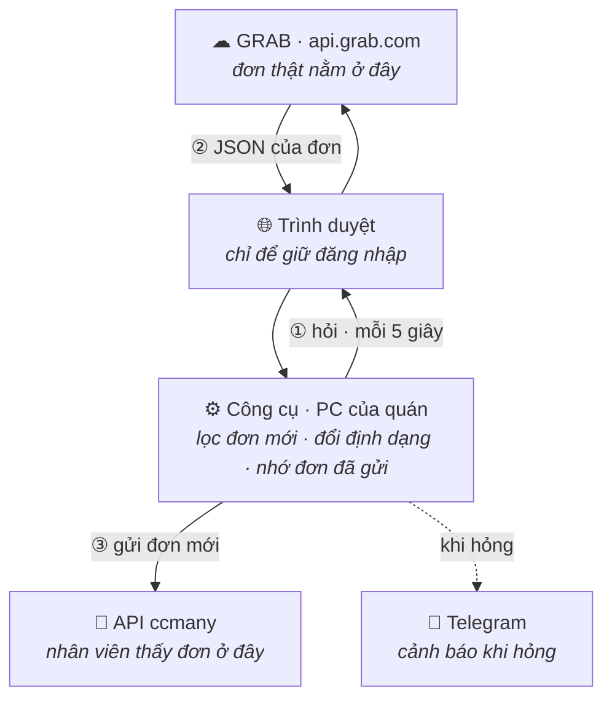

# Spec vận hành — công cụ theo dõi đơn Grab Merchant

Tài liệu này mô tả **công cụ chạy như thế nào trong thực tế**: móc vào trình duyệt ra sao,
máy tính phải ở trạng thái nào, nhiều quán thì tổ chức thế nào, hỏng thì tự phục hồi ra sao.

Phần API, cấu trúc JSON, ánh xạ trường và các bẫy dữ liệu nằm ở
[grab-api-findings.md](grab-api-findings.md) — spec này **không lặp lại**, chỉ tham chiếu.

> **Trạng thái: chờ duyệt.** Đọc xong, cái nào không đồng ý thì nói trước khi viết code.

---

## 1. Công cụ này làm gì

Một câu: **canh trang đơn hàng Grab Merchant trên PC của quán, thấy đơn mới thì đẩy sang API
ccmany trong vòng vài giây, để nhân viên biết mà đi xác nhận.**

### Làm

- Đăng nhập Grab Merchant **một lần bằng tay**, sau đó tự giữ phiên
- Hỏi danh sách đơn tab "Đang chuẩn bị" mỗi **5 giây**
- Thấy đơn chưa từng gặp → lấy chi tiết → chuyển sang định dạng ccmany → POST
- Ghi nhớ đơn đã gửi để không gửi lại
- Báo Telegram khi có sự cố (mất phiên, ccmany chết, poll đứng)

### KHÔNG làm

| Không làm | Vì sao |
|---|---|
| Bấm "Nhận đơn" | Ngoài phạm vi; quyết định nhận đơn là của người |
| Gọi `POST /orders/mark` | Sẽ xoá dấu "chưa đọc" của nhân viên trên web — họ tưởng đơn đã xử lý |
| Gửi cập nhật khi đơn bị huỷ / sửa | Đã chốt "gửi một lần rồi thôi" |
| Đọc sao kê, doanh thu, lịch sử | Không cần cho mục tiêu báo đơn mới |
| Bất kỳ request `POST`/`PUT`/`DELETE` nào tới Grab | **Công cụ chỉ `GET`.** Đây là ranh giới cứng |

---

## 2. Sơ đồ

### 2.1 Poll lấy dữ liệu ở tầng nào

Câu trả lời ngắn: **không đọc giao diện. Đọc thẳng tầng dữ liệu.**

```
                         ┌─── người nhìn thấy ───┐
   ┌─────────────────────────────────────────────────────────────┐
   │  TẦNG 3 · GIAO DIỆN                                         │
   │  Chữ, nút bấm, pixel trên màn hình                          │
   │  "GF-547"   "121.000đ"   [Nhận đơn]                         │
   │                                                             │
   │        ✗  CÔNG CỤ NÀY KHÔNG ĐỌC Ở ĐÂY                       │
   │        ←  (notiftest bên Android thì đọc ở đây:             │
   │            uiautomator dump → parse XML → mò từng chữ)      │
   └───────────────────────────▲─────────────────────────────────┘
                               │  trang tự vẽ giao diện ra từ dữ liệu
   ┌───────────────────────────┴─────────────────────────────────┐
   │  TẦNG 2 · DỮ LIỆU (JSON)                                    │
   │  { "orderID":"0015...", "displayID":"GF-547",               │
   │    "items":[...], "fare":{ "totalDisplay":"121.000" } }     │
   │                                                             │
   │        ✓✓  CÔNG CỤ NÀY LẤY Ở ĐÂY                            │
   │            gọi đúng cái API mà trang web tự gọi              │
   └───────────────────────────▲─────────────────────────────────┘
                               │  HTTPS + cookie đăng nhập
   ┌───────────────────────────┴─────────────────────────────────┐
   │  TẦNG 1 · MÁY CHỦ GRAB — api.grab.com                       │
   │  Kho đơn thật. Nguồn của mọi thứ.                           │
   └─────────────────────────────────────────────────────────────┘
```

**Nói cách khác**: trình duyệt lấy JSON về rồi vẽ thành giao diện cho người xem.
Công cụ chen vào **trước bước vẽ** — lấy luôn JSON, khỏi cần vẽ, khỏi cần đọc chữ trên màn hình.

Hệ quả rất thực tế:

| Grab thay đổi cái gì | Công cụ này | notiftest (Android) |
|---|---|---|
| Đổi giao diện, đổi màu, đổi vị trí nút | ✅ Không ảnh hưởng | ❌ Hỏng, phải sửa parser |
| Đổi ngôn ngữ hiển thị | ✅ Không ảnh hưởng | ❌ Hỏng |
| Đổi cấu trúc JSON của API | ❌ Hỏng, phải sửa mapper | ✅ Không ảnh hưởng |

Đây là lý do bản web dễ nuôi hơn bản Android nhiều: giao diện thì Grab đổi liên tục, còn API
thì hiếm khi đổi, và khi đổi thì thường thêm phiên bản mới (`v3` → `v4`) chứ không phá cái cũ.

### 2.2 Sơ đồ tổng thể

```
        ┌──────────────────────────────────────────┐
        │   ☁   GRAB  ·  api.grab.com              │   đơn thật nằm ở đây
        └─────────────────────▲────────────────────┘
                              │
               ①  hỏi "có đơn mới không?"  — mỗi 5 giây
               ②  Grab trả về JSON của đơn
                              │
        ┌─────────────────────┴────────────────────┐
        │   🌐   Trình duyệt                        │   chỉ để giữ đăng nhập
        └─────────────────────▲────────────────────┘
                              │
        ┌─────────────────────┴────────────────────┐
        │   ⚙   Công cụ  ·  PC của quán            │   lọc ra đơn chưa từng gặp
        │                                          │   đổi sang định dạng ccmany
        └──────┬────────────────────────┬──────────┘   nhớ đơn đã gửi
               │                        ┊
               │ ③ gửi đơn mới          ┊ cảnh báo khi hỏng
               ▼                        ┊
     ┌────────────────────┐             ┊
     │  🎯  API ccmany    │        📢  Telegram
     └────────────────────┘
```

Nhân viên mở ccmany là thấy đơn, khoảng **1–6 giây** sau khi khách đặt.

Chi tiết từng bước — lấy gì, lọc thế nào, hỏng thì làm sao — nằm ở §4.

### 2.3 Bản mermaid



---

## 3. Móc nối vào Grab Merchant bằng cách nào

Đây là câu hỏi trung tâm, nên nói kỹ.

### 3.1 Vì sao phải qua trình duyệt

Xác thực của Grab là **cookie** (đã xác minh — xem §2 của `grab-api-findings.md`). Cookie đó:

- Không nằm ở chỗ nào đọc được dễ dàng ngoài profile trình duyệt
- Được gia hạn theo phiên khi trang còn sống
- Chỉ lấy được sau khi đăng nhập bằng tay (có thể có OTP)

Nên mình **không tự gọi API từ Node bằng `axios`** — sẽ phải tự bóc cookie, tự lo hết hạn,
tự lo OTP. Thay vào đó: mở một Chromium do mình điều khiển, đăng nhập tay một lần, rồi
**gọi API từ bên trong trang đó**.

### 3.2 Cơ chế cụ thể

```
Node                                          Chromium (trang merchant.grab.com)
────                                          ──────────────────────────────────
chromium.launchPersistentContext(
   userDataDir: ./data/browser-profile )
                                              → khôi phục cookie từ lần trước
page.goto('https://merchant.grab.com/
           order/5-C7XUNYEVEADYN2/preparing')
                                              → trang chạy bình thường, phiên sống

mỗi 5 giây:
  page.evaluate(async (mexID) => {
    const r = await fetch(
      `https://api.grab.com/delvplatformapi/
       merchant/v4/orders-pagination?...`,
      { credentials: 'include',            ──► trình duyệt TỰ gắn cookie
        headers: { merchantID, requestSource,
                   'x-client-id', ... } });
    return { status: r.status,
             body: await r.json() };
  }, mexID)
       ◄── kết quả trả về Node dưới dạng JSON
```

Vì `fetch` chạy **bên trong trang**, trình duyệt tự lo: cookie, `Origin`, `Referer`, CORS
preflight — đúng y như khi trang tự gọi. Mình không giả mạo gì cả.

> **Phương án thay thế** (nếu `page.evaluate` gặp trở ngại): Playwright có
> `context.request.get()` dùng chung kho cookie của context. Sạch hơn nhưng phải tự set
> `Origin`/`Referer`. Để dành làm dự phòng.

### 3.3 Vòng lặp hẹn giờ nằm ở Node, KHÔNG nằm trong trang

Chi tiết nhỏ nhưng cực quan trọng: Chromium **bóp cổ `setTimeout`/`setInterval` của tab chạy
nền** — tab bị che khuất hoặc cửa sổ thu nhỏ thì hẹn giờ bị giãn xuống còn ~1 lần/phút.
Nếu để vòng lặp poll chạy bằng JS trong trang, cứ minimize cửa sổ là công cụ chết lâm sàng
mà không báo lỗi gì.

Nên: **`setInterval` nằm ở Node** (không bị bóp), mỗi nhịp gọi `page.evaluate` một phát.
Kèm theo đó, mở Chromium với các cờ:

```
--disable-background-timer-throttling
--disable-backgrounding-occluded-windows
--disable-renderer-backgrounding
```

### 3.4 Headed hay headless

Chạy **headed** (có cửa sổ thật). Lý do:

- Đăng nhập lần đầu và đăng nhập lại bắt buộc phải thấy màn hình (có thể có OTP)
- Ít bị nghi là bot hơn
- Khi có sự cố, mở ra nhìn là biết ngay đang kẹt ở đâu

Cửa sổ có thể **thu nhỏ**, không cần nhìn thấy. Đã có cờ chống bóp cổ ở trên.

Hai lệnh chạy:

| Lệnh | Dùng khi | Chế độ |
|---|---|---|
| `npm run login` | Lần đầu, hoặc khi mất phiên | Headed, dừng lại chờ bạn đăng nhập xong |
| `npm run start` | Chạy thường ngày (tự khởi động cùng Windows) | Headed, thu nhỏ, tự chạy |

Cả hai **dùng chung một `userDataDir`**, nên đăng nhập một lần là lần sau tự vào.

### 3.5 Profile riêng, không đụng trình duyệt của người

Chromium của công cụ dùng thư mục profile riêng (`data/browser-profile/`), **tách hoàn toàn**
khỏi Chrome/Edge mà người dùng bình thường. Hệ quả:

- Nhân viên đóng trình duyệt của họ → công cụ không sao
- Nhân viên xoá cookie, đăng nhập tài khoản khác → công cụ không sao
- Ngược lại, **không được tự tay đóng cửa sổ Chromium của công cụ** — đóng là dừng luôn

> ⚠️ **Cần kiểm chứng trước khi triển khai**: Grab có cho phép **nhiều phiên đăng nhập cùng
> lúc** trên một tài khoản không? Nếu Grab đá phiên cũ khi có phiên mới, thì việc công cụ đăng
> nhập có thể làm nhân viên bị đăng xuất khỏi web/app của họ. Cách thử: đăng nhập vào Chromium
> của công cụ, rồi kiểm tra xem phiên đang mở trên máy/điện thoại khác có còn dùng được không.
> Đây là rủi ro vận hành lớn nhất còn lại — xem §11.

---

## 4. Luồng chính — từ lúc khách đặt tới lúc đơn về ccmany

```
 t=0s     Khách đặt đơn trên app Grab
            │
            ▼
 t=0s     Đơn xuất hiện trong hệ thống Grab (times.createdAt)
            │
            │   (cổng web của Grab phải tới 60s sau mới biết —
            │    mình nhanh hơn vì poll dày hơn)
            ▼
 t≤5s    Poller gọi orders-pagination (PageType=PreparingV2)
            │
            ▼
          Có orderID nào chưa nằm trong cache không?
            │
            ├── Không ──► ngủ tiếp 5s
            │
            └── Có
                 │
                 ▼
 t+~0.3s      GET /food/merchant/v3/orders/{orderID}      ← chi tiết, có giá & topping
                 │                                          (KHÔNG gọi /orders/mark)
                 ▼
              Lưu JSON thô ra data/raw/{orderID}.json     ← để sau còn sửa mapper
                 │
                 ▼
              Mapper: Grab JSON → payload ccmany
                 │   • order_number = orderID, order_code = displayID
                 │   • item.price = parse(priceDisplay)   (đã gồm topping)
                 │   • total = fare.totalDisplay
                 │   • kiểm tra total ≈ subtotal − discount − tax → lệch thì cảnh báo
                 ▼
 t+~0.5s      POST lên ccmany  (x-api-key, timeout 15s, retry 3 lần backoff)
                 │
                 ├── Thất bại cả 3 lần ──► đưa vào hàng đợi lỗi, KHÔNG ghi cache
                 │                          → lượt poll sau thử lại
                 └── Thành công
                       │
                       ▼
                    Ghi cache: {ccmanyStoreID}:{orderID}   ← chỉ ghi SAU khi thành công
                       │
                       ▼
                    Telegram: "GF-547 · 121.000đ · 5 món"  (tuỳ chọn)

 → Tổng độ trễ điển hình: 1–6 giây kể từ lúc khách đặt.
```

### Vì sao ghi cache sau khi POST thành công, không phải trước

Nếu ghi trước mà POST hỏng, đơn đó **vĩnh viễn không bao giờ được gửi lại** — công cụ tưởng
đã xong. Ghi sau thì tệ nhất là gửi trùng một lần (khi POST thành công nhưng ghi cache hỏng),
mà gửi trùng thì ccmany còn dedup được bằng `order_number`, còn mất đơn thì không cứu được.

---

## 5. Vòng đời một đơn, nhìn từ công cụ

```
   ┌─────────┐  thấy trong orders-pagination
   │  MỚI    │  (không quan tâm acceptedAt)
   └────┬────┘
        │ gọi detail
        ▼
   ┌─────────┐  detail lỗi / JSON lạ
   │ ĐANG ĐỌC├──────────────────────► ┌────────┐
   └────┬────┘                         │  LỖI   │ ─┐
        │ mapper OK                    └────────┘  │ thử lại
        ▼                                   ▲      │ ở lượt
   ┌─────────┐  POST hỏng cả 3 lần          │      │ poll sau
   │ ĐANG GỬI├──────────────────────────────┘      │
   └────┬────┘                                     │
        │ POST 2xx                            ◄────┘
        ▼
   ┌─────────┐
   │ ĐÃ GỬI  │  ghi vào cache — không bao giờ đụng lại
   └─────────┘
```

Đơn ở trạng thái **LỖI** không được ghi cache, nên lượt poll sau nó lại hiện ra như đơn mới và
được thử lại. Số lần thử có trần (mặc định 5) để một đơn hỏng vĩnh viễn không làm kẹt hàng đợi;
quá trần thì bắn Telegram kèm `orderID` và bỏ qua.

---

## 6. Chống gửi trùng — hai lớp

Vì công cụ **không bao giờ bấm nhận đơn**, đơn nằm lì trong tab "Đang chuẩn bị" cho tới khi
nhân viên xử lý. Nghĩa là mỗi lượt poll đều nhìn thấy lại đúng những đơn đó.
**Cache là thứ duy nhất chặn gửi trùng** — y như notiftest.

| Lớp | Cơ chế | Chặn được gì |
|---|---|---|
| 1 | Cache `{ccmanyStoreID}:{orderID}`, ghi ra `data/cache/`, nạp lại lúc khởi động | Gửi trùng khi poll lặp, và khi khởi động lại bình thường |
| 2 | Chỉ xử lý đơn có `createdAt > max(mốc đã lưu, lúc khởi động − 15 phút)` | Mất/hỏng file cache thì cũng chỉ gửi lại đơn của 15 phút gần nhất, thay vì cả tab |

Lớp 2 vá đúng lỗ hổng còn tồn tại ở notiftest (mất cache → sweep bắn lại toàn bộ danh sách).

Cache giới hạn theo số lượng (mặc định 500 đơn gần nhất mỗi quán), cũ nhất bị đẩy ra.

---

## 7. Nhiều quán

Đã xác nhận: **một tài khoản Grab quản nhiều quán**. Điều đó làm mọi thứ đơn giản.

### 7.1 Cách tổ chức

Cookie là **của tài khoản**, không phải của từng quán. Mã quán đi kèm mỗi request qua tham số
`merchantID` và header `merchantid`. Nên:

```
1 Chromium  →  1 profile  →  1 tab
                              │
                              ├── poll quán A (merchantID = 5-AAA...)
                              ├── poll quán B (merchantID = 5-BBB...)
                              └── poll quán C (merchantID = 5-CCC...)
```

**Một tab phục vụ tất cả các quán.** Thêm quán không tốn thêm RAM, chỉ tốn thêm request.
Các quán poll **lệch pha nhau** (quán thứ n bắt đầu trễ `n × 5s/số_quán`) để không dồn cục.

> **Cần kiểm chứng khi có quán thứ hai**: API có chấp nhận `merchantID` của quán B trong khi
> tab đang mở trang của quán A không? Về lý thuyết có, vì mã quán nằm tường minh trong request.
> Nếu bị `403` thì rơi về phương án dự phòng: **mỗi quán một tab**, cùng profile — vẫn chỉ một
> lần đăng nhập, chỉ tốn thêm ~50MB RAM mỗi tab.

### 7.2 File cấu hình là nguồn sự thật duy nhất

`config/stores.json`:

```jsonc
{
  "stores": [
    {
      "grabMerchantID": "5-C7XUNYEVEADYN2",   // lấy từ URL trang đơn hàng
      "ccmanyStoreID":  "STORE1",             // mã do ccmany cấp
      "storeName":      "Tên quán",
      "enabled":        true
    }
  ]
}
```

Thêm quán = thêm một khối, khởi động lại tiến trình. **Không sửa code, không build lại**
(khác notiftest — bên đó mã quán nằm trong `BuildConfig`, đổi là phải build + cài lại app).

Cache tách theo `ccmanyStoreID` nên hai quán không thể dẫm chân nhau.

---

## 8. Máy tính phải ở trạng thái nào

Câu hỏi hay gặp nhất, nên liệt kê thẳng:

| Trạng thái | Có chạy được không | Ghi chú |
|---|---|---|
| **Màn hình tắt** (monitor ngủ) | ✅ Chạy bình thường | Chromium không cần pixel hiển thị |
| **Khoá màn hình** (`Win+L`) | ✅ Chạy bình thường | Phiên Windows vẫn sống |
| **Cửa sổ Chromium thu nhỏ** | ✅ Chạy bình thường | Nhờ 3 cờ chống bóp cổ ở §3.3 |
| **Cửa sổ bị che bởi app khác** | ✅ Chạy bình thường | Như trên |
| **Máy ngủ / ngủ đông** (Sleep/Hibernate) | ❌ **DỪNG** | Bắt buộc tắt trong Power Options |
| **Đăng xuất Windows** (Sign out) | ❌ **DỪNG** | Phiên bị huỷ, Chromium chết theo |
| **Khởi động lại máy** | ⚠️ Tự chạy lại **nếu** đã bật tự đăng nhập Windows | Xem §9 |
| **Mất mạng** | ⚠️ Tạm dừng, tự nối lại | Đơn phát sinh trong lúc mất mạng vẫn bắt được khi có mạng lại, miễn còn trong tab |
| Chạy như **Windows Service** | ❌ Không dùng | Service chạy ở session 0, không có desktop → không mở được cửa sổ trình duyệt |

**Ba thứ bắt buộc phải cấu hình trên PC:**

1. **Tắt Sleep và Hibernate** — Settings → Power → *Screen and sleep* → `Never` (mục sleep).
   Màn hình tắt thì thoải mái, chỉ máy là không được ngủ.
2. **Bật tự đăng nhập Windows** — để sau khi mất điện / cập nhật Windows, máy khởi động lại là
   tự vào desktop, công cụ tự chạy. Không có cái này thì mỗi lần reboot phải có người tới gõ
   mật khẩu.
3. **Hoãn cập nhật tự động khởi động lại** — đặt Active hours trùng giờ mở quán.

---

## 9. Khởi động và tự phục hồi

### Chuỗi khởi động

```
Windows khởi động
   └── tự đăng nhập vào tài khoản Windows
         └── Task Scheduler (trigger: At log on) chạy grab-watcher
               └── mở Chromium với profile đã lưu
                     ├── vào được trang đơn hàng?  ──► bắt đầu poll
                     └── bị đá về trang đăng nhập? ──► Telegram: "CẦN ĐĂNG NHẬP LẠI"
                                                        rồi chờ, poll lại mỗi 60s
```

Dùng **Task Scheduler** với trigger *"At log on"*, **không dùng Windows Service** (lý do ở
bảng §8).

### Tự phục hồi

| Hỏng ở đâu | Phát hiện bằng | Xử lý |
|---|---|---|
| Chromium chết / bị đóng | `page.isClosed()` hoặc lỗi CDP | Mở lại, vào lại trang, tiếp tục poll |
| Tiến trình Node chết | Task Scheduler đặt *Restart on failure* | Chạy lại; cache trên đĩa nên không mất đơn |
| Phiên Grab hết hạn | HTTP `401`/`403`, hoặc bị chuyển về trang login | Ngừng poll, Telegram cảnh báo, thử lại mỗi 60s cho tới khi người đăng nhập lại |
| ccmany không phản hồi | timeout / mã `5xx` | Retry 3 lần backoff; vẫn hỏng thì giữ trong hàng đợi lỗi, thử lại lượt sau |
| Grab đổi API (404 / JSON lạ) | Mapper ném lỗi khi thiếu trường bắt buộc | Lưu JSON thô, Telegram kèm `orderID`, bỏ qua đơn đó, **không làm chết tiến trình** |
| Bị giới hạn tần suất (`429`) | Mã lỗi | Giãn nhịp poll gấp đôi mỗi lần, trần 60s, về lại 5s khi hết lỗi |
| Poll đứng im (không lỗi, không kết quả) | Không có lượt poll thành công nào trong 3 phút | Telegram cảnh báo, khởi động lại trình duyệt |

### Chạy dài ngày — cái gì sẽ hỏng trước

Câu hỏi thật: **điều kiện lý tưởng thì nó chạy được bao lâu?**

Trả lời thẳng: **không có "mãi mãi", nhưng cũng không phải "nửa hôm là crash".** Nếu nửa ngày
đã chết thì đó là bug, không phải giới hạn. Mục tiêu hợp lý là **hàng tuần không cần đụng vào**,
với điều kiện xây sẵn ba thứ chống bào mòn ở dưới.

Xếp theo thứ tự "cái nào hỏng trước":

| Thứ tự | Nguyên nhân | Sau bao lâu | Xử lý |
|---|---|---|---|
| 1 | **Chromium phình bộ nhớ.** Một tab SPA để mở liên tục sẽ tích luỹ rác — Grab tự poll 60s/lần và dồn state vào trang | Vài ngày | Tự `reload()` trang mỗi **60 phút**. Cookie nằm trong profile nên reload không mất phiên |
| 2 | **Cookie phiên Grab hết hạn.** Cái này không code nào tránh được — hạn là do Grab đặt | Chưa biết, phải quan sát. Thường vài ngày đến vài tuần | Phát hiện bằng `401` → Telegram "cần đăng nhập lại" → người vào bấm đăng nhập, mất 1 phút |
| 3 | **Windows Update ép khởi động lại** | ~1 tháng | Tự đăng nhập Windows + Task Scheduler *At log on* → tự chạy lại, không cần người |
| 4 | **Đĩa đầy dần** vì `data/raw/` và file log | Vài tuần đến vài tháng | Tự xoá `raw` quá `RAW_RETENTION_DAYS`; xoay vòng log theo kích thước |
| 5 | **Rò rỉ bộ nhớ ở tiến trình Node** | Vài tuần, nếu code sạch | Cache có trần cứng, không giữ mảng vô hạn; khởi động lại theo lịch hằng tuần cho chắc |
| 6 | **Kết nối điều khiển Playwright rớt** | Hiếm | Bắt lỗi → mở lại trình duyệt, poll tiếp |
| 7 | **Lỗi không bắt được làm chết Node** | Không nên xảy ra | `unhandledRejection` / `uncaughtException` đều có handler ghi log; Task Scheduler bật *Restart on failure* |

**Điểm mấu chốt: số 2 là thứ duy nhất bắt buộc cần con người.** Sáu cái còn lại đều tự xử được.
Nên câu trả lời thực tế là: *chạy liên tục cho tới khi Grab hết hạn phiên, rồi cần một người bấm
đăng nhập một lần.* Chu kỳ đó dài bao nhiêu thì chỉ biết sau khi chạy thật vài tuần.

### Lịch tự làm mới

Ba mức, từ nhẹ tới nặng, để không bao giờ chạm tới ngưỡng hỏng:

```
mỗi 60 phút   →  page.reload()                 nhẹ, không mất phiên, dọn rác trang
mỗi ngày      →  đóng & mở lại Chromium        lúc quán đóng cửa (theo open-status)
mỗi tuần      →  khởi động lại tiến trình Node  Task Scheduler, giờ quán đóng
```

Tất cả đều **né giờ có đơn**: kiểm tra không có đơn nào đang xử lý dở trước khi làm mới, và
nếu đang bận thì hoãn tới nhịp sau. Cache nằm trên đĩa nên làm mới kiểu gì cũng không mất đơn
đã gửi, và cửa sổ thời gian 15 phút (§6) đảm bảo không gửi lại đơn cũ sau khi khởi động lại.

### Nhịp tim

Mỗi **30 phút**, gửi Telegram một dòng: số đơn đã gửi trong kỳ, trạng thái mở/đóng của quán,
thời điểm poll thành công gần nhất. Im lặng quá lâu = có chuyện.

---

## 10. Cấu hình

### `.env` (không commit)

```
CCMANY_API_URL=https://manage.ccmany.net/api/orders
CCMANY_API_KEY=<khoá>
TELEGRAM_BOT_TOKEN=            # tuỳ chọn
TELEGRAM_CHAT_ID=
POLL_INTERVAL_MS=5000          # mặc định 5s; tối thiểu 3000
POLL_INTERVAL_CLOSED_MS=30000  # khi quán đóng cửa thì giãn ra
RAW_RETENTION_DAYS=14          # giữ JSON thô bao lâu rồi tự xoá
```

### Vì sao mặc định 5 giây

Cổng web của Grab poll 60s. Mình 5s là nhanh hơn 12 lần, đủ để "gần như tức thì" với người,
mà vẫn không phải là hành vi bất thường tới mức đáng ngờ. Cửa sổ xác nhận đơn của Grab là
**5 phút**, nên 5s cho mình ~60 lần kiểm tra trong cửa sổ đó. Xuống 3s được nhưng lợi ích
thêm là không đáng kể.

Khi `open-status` báo quán đóng cửa → giãn xuống 30s (đơn không thể vào lúc đóng cửa).

### Cấu trúc thư mục dự kiến

```
notiftest-supportGrab/
├── config/
│   └── stores.json           # danh sách quán — nguồn sự thật
├── src/
│   ├── index.ts              # điểm vào, vòng đời tiến trình
│   ├── browser.ts            # mở/giữ/hồi phục Chromium + profile
│   ├── grab/
│   │   ├── client.ts         # gọi API Grab qua page.evaluate
│   │   ├── types.ts          # kiểu dữ liệu response Grab
│   │   └── mapper.ts         # Grab JSON → payload ccmany
│   ├── poller.ts             # vòng lặp theo từng quán
│   ├── cache.ts              # chống trùng 2 lớp, persist ra đĩa
│   ├── uploader/
│   │   ├── ccmany.ts         # POST + retry + timeout
│   │   └── telegram.ts       # cảnh báo + đơn đã gửi
│   └── log.ts
├── data/                     # gitignore
│   ├── browser-profile/      # cookie đăng nhập — KHÔNG sao chép đi đâu
│   ├── cache/
│   └── raw/                  # JSON thô của từng đơn
├── docs/
│   ├── grab-api-findings.md
│   └── spec-van-hanh.md      # file này
└── example/har/              # HAR mẫu — gitignore
```

---

## 11. An toàn & dữ liệu nhạy cảm

| Thứ | Chứa gì | Quy tắc |
|---|---|---|
| `data/browser-profile/` | **Cookie đăng nhập Grab** — tương đương mật khẩu | Không commit, không copy sang máy khác, không nén gửi cho ai |
| `data/raw/*.json` | Tên + số điện thoại khách, địa chỉ | Gitignore; tự xoá sau `RAW_RETENTION_DAYS` |
| `example/har/*.har` | Như trên | Gitignore |
| `.env` | Khoá API ccmany, token Telegram | Gitignore |

**Ranh giới cứng**: công cụ chỉ gửi `GET` tới `api.grab.com`. Không có `POST` nào tới Grab
trong toàn bộ mã nguồn. Nếu sau này ai thêm vào, coi như đổi bản chất dự án và phải bàn lại.

---

## 12. Cài đặt lần đầu — danh sách việc

1. Cài Node LTS trên PC quán
2. `npm install` → `npx playwright install chromium`
3. Điền `.env` (khoá ccmany, token Telegram)
4. Điền `config/stores.json` (mã quán Grab lấy từ URL, mã ccmany do bên vận hành cấp)
5. `npm run login` → cửa sổ Chromium mở ra → **đăng nhập Grab bằng tay** → đóng lệnh lại
6. `npm run start` → xác nhận Telegram nhận được tin nhắn "đã khởi động"
7. Đặt đơn thử một cái → xác nhận nó về ccmany trong vài giây
8. Cấu hình PC: tắt sleep, bật tự đăng nhập Windows, đặt Active hours
9. Tạo Task Scheduler *At log on* → khởi động lại máy để kiểm tra tự chạy

---

## 13. Rủi ro đã biết

| Rủi ro | Mức | Xử lý |
|---|---|---|
| **Grab chỉ cho một phiên đăng nhập** → công cụ đá nhân viên ra | **Cao** | Phải thử trước bước 5 ở §12. Nếu đúng thì cả phương án này phải bàn lại |
| Grab đổi API | Trung bình | Lưu JSON thô mọi đơn → có cái mà sửa mapper. Mapper ném lỗi rõ ràng thay vì gửi số sai |
| `total` là tiền trước chiết khấu sàn | Trung bình | Đã chốt chấp nhận (§6.1 doc kia). Có sao kê thật thì đối chiếu lại sau |
| Đơn hết hạn/huỷ vẫn đã gửi | Thấp | Chấp nhận — đó là cái giá của việc báo sớm |
| PC hỏng / mất điện dài | Thấp | Không có phương án dự phòng; đây là công cụ chạy trên một máy |
| Phải đăng nhập lại định kỳ khi cookie hết hạn | Thấp | Không tránh được; Telegram báo, người bấm 1 phút là xong — §9 |
| Poll 5s bị Grab coi là bất thường | Thấp | Lùi về 10s nếu gặp `429` nhiều |

---

## 14. Cái spec này chưa trả lời

- Có cần giao diện xem log/trạng thái không, hay chỉ cần Telegram? *(hiện thiết kế: chỉ Telegram + file log)*
- Có cần nút "gửi lại đơn X bằng tay" không? *(hiện thiết kế: không có)*
- Có cần chạy song song với notiftest trên cùng hệ thống ccmany không, và ccmany có phân biệt
  được nguồn Grab với nguồn Green SM không? *(payload không có trường "nguồn")*

Ba câu này không chặn việc bắt đầu, nhưng nếu bạn có ý thì nói luôn để khỏi sửa sau.
